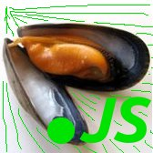
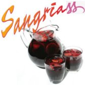

# Paella Framework
El framework del verano, el framework para hacer Paellas Orientadas a Objetos (OOP) y calamar widgets

Basado en  y . 

¡No lo dudes! Instálalo *AHORA* y podrás usarlo en tu *Ferrari sin ruedas*:

```
npm install https://github.com/xgbuils/musclets.js
```

## API

### JS
- `_.sofregit(paella, temps, params)`

- `_.tocMestre(fillfree)`

### CSS
- `paella_with_no_units mixin`
pots ficar grans d'arros o olives arbequines

## Related frameworks
el framework `paella` va de puta mare amb el el preprocessador `sangria`


